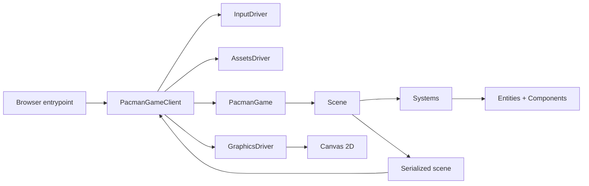

# Pac-Man JS

A small Pac-Man-style game prototype built with TypeScript, Vite, and the Canvas 2D API.

The project is organized around a lightweight game engine, browser-facing client drivers, shared utilities, and a Pac-Man application module. The current focus is the architecture of the runtime: scenes own entities and systems, systems mutate component state, and the client renders serialized scene snapshots to a canvas.

## Requirements

- Node.js 22 or newer
- pnpm

## Getting Started

Install dependencies:

```sh
pnpm install
```

Start the Vite development server:

```sh
pnpm dev
```

Open the app at:

```text
http://localhost:3000
```

## Scripts

- `pnpm dev`: start the Vite development server.
- `pnpm build`: run TypeScript and create a production build.
- `pnpm test`: run the Vitest test suite.
- `pnpm preview`: preview the production build locally.

## Controls

- Arrow Up: move up.
- Arrow Down: move down.
- Arrow Left: move left.
- Arrow Right: move right.

## Project Structure

```text
src/
  main.ts                         Browser entry point
  app/pacman/                     Pac-Man-specific game module
  packages/game-engine/           Entity, component, system, scene, and manager primitives
  packages/game-client/           Browser drivers for input, assets, graphics, and client orchestration
  packages/shared/                Framework-agnostic utilities, interfaces, constants, and data structures
  tests/                          Vitest unit tests and mockers
assets/                           Sprite sheet and font assets loaded by the browser client
docs/                             Architecture, module, pattern, and issue documentation
```

## Runtime Overview



1. `src/main.ts` creates the input, asset, and graphics drivers.
2. `PacmanGameClient` loads assets, subscribes to game snapshots, reads keyboard input, and runs the animation loop.
3. `PacmanGame` stores the active scene and queues client events.
4. A `Scene` updates its systems with elapsed time, queued events, and the entity manager.
5. Systems mutate component state, such as actor direction, position, and animation frame.
6. The scene serializes entities and components.
7. The client draws UI text and sprites from the serialized snapshot.

## Documentation

Start with [docs/README.md](./docs/README.md) for module guides and reusable patterns.

The most important docs are:

- [Pac-Man module](./docs/modules/pacman-module.md)
- [Game engine module](./docs/modules/game-engine-module.md)
- [Game client module](./docs/modules/game-client-module.md)
- [Shared module](./docs/modules/shared-module.md)
- [Entity-component-system pattern](./docs/patterns/game/entity-component-system-pattern.md)
- [Scene serialization pattern](./docs/patterns/game/scene-serialization-pattern.md)
- [Client driver pattern](./docs/patterns/client/client-driver-pattern.md)

## Development Notes

- Keep game-specific behavior under `src/app/pacman`.
- Keep reusable runtime primitives under `src/packages/game-engine`.
- Keep browser APIs behind `src/packages/game-client` drivers.
- Keep framework-agnostic types, data structures, and constants under `src/packages/shared`.
- Prefer adding new behavior as components and systems instead of coupling feature logic directly into the client.
- Preserve the serialized scene boundary between the game runtime and renderer.
